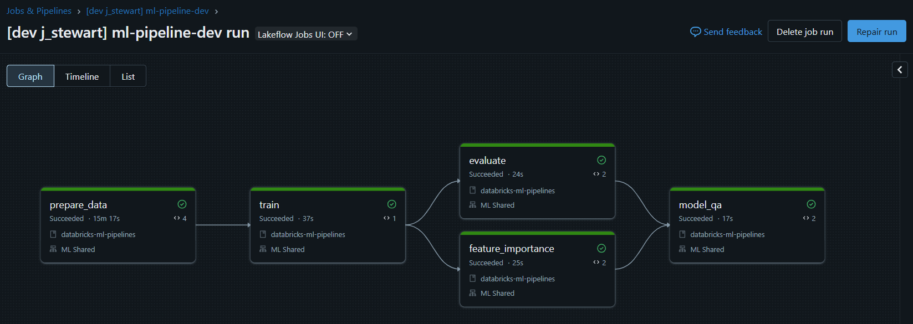

## Quickstart

### Setup

**Install uv**:

```bash
curl -LsSf https://astral.sh/uv/install.sh | sh
```

**Install the Databricks CLI and authenticate with OAuth**:

See [here](https://docs.databricks.com/aws/en/dev-tools/cli/tutorial).

**Install OpenJDK 17 for local Spark sessions** (Ubuntu/Debian):

```bash
sudo apt-get update && sudo apt-get install -y openjdk-17-jdk
```

**Install project dependencies**:

```bash
uv sync
```

### Run locally

**Run the full pipeline locally**:

```bash
uv run local-pipeline
```

**View MLflow experiment runs locally**:

```bash
uv run mlflow server --host 127.0.0.1 --port 8080
```

Then open `http://127.0.0.1:8080` in your browser.

### Deploy and run on Databricks

**Deploy the Lakeflow bundle to the dev target**:

```bash
databricks bundle deploy --target dev
```

**Run the job**:
- From the UI: open Jobs → `ml-pipeline-dev` → Run now
- Or via CLI:

```bash
databricks bundle run ml_pipeline_dev --target dev
```

---

## Databricks ML Pipelines – Lakeflow + Hydra + MLflow

This repo demonstrates a maintainable alternative to ad‑hoc Databricks notebooks for ML pipelines. It shows how to:
- **Break the pipeline into steps** with clear interfaces and different compute profiles
- **Run steps as Databricks Lakeflow Job tasks** using Python wheel entrypoints
- **Configure behavior with Hydra** (local/dev/prod overlays)
- **Track experiments and artifacts with MLflow**, including dataset lineage for Delta inputs
- **Use Spark only for data preparation**, persist intermediate datasets as Delta in a Volume, then **switch to Polars** for fast model workflows

---

## ML Pipeline as a Databricks Job



## Orchestration with Databricks Asset Bundles (Lakeflow)

- Bundle definition: `databricks.yml`
  - Defines bundle name, targets (`dev`, `prod`), and the wheel artifact build via `uv build --wheel`.
  - Exposes a variable `pipeline` used to select the Hydra profile (e.g., `databricks-dev`, `databricks-prod`).
- Job definition: `resources/ml_pipeline.job.yml`
  - Tasks run Python wheel entrypoints from `pyproject.toml [project.scripts]`:
    - `prepare-data`, `train-model`, `evaluate-model`, `feature-importance`, `model-qa`
  - `depends_on` wires task order: `prepare_data -> train -> (evaluate & feature_importance) -> model_qa`
  - All tasks currently point to an `existing_cluster_id` which is currently set to the ID for Shared ML. In future, we should be able to just use the spark cluste for `prepare_data` and then have the rest of the steps use a smaller, single-node cluster since we won't be touching spark.

```12:58:/home/josh/repos/databricks-ml-pipelines/resources/ml_pipeline.job.yml
resources:
  jobs:
    ml_pipeline_dev:
      name: ml-pipeline-dev
      ...
      tasks:
        - task_key: prepare_data
          python_wheel_task:
            package_name: databricks-ml-pipelines
            entry_point: prepare-data
            parameters: ["pipeline=${var.pipeline}"]
          libraries:
            - whl: ../dist/*.whl
          existing_cluster_id: "0609-090345-4rjuomtp"
        - task_key: train
          depends_on:
            - task_key: prepare_data
          python_wheel_task:
            package_name: databricks-ml-pipelines
            entry_point: train-model
            parameters: ["pipeline=${var.pipeline}"]
          libraries:
            - whl: ../dist/*.whl
          existing_cluster_id: "0609-090345-4rjuomtp"
        ...
```

- Hydra profile selection is passed via `parameters: ["pipeline=${var.pipeline}"]`. The bundle target sets this variable:

```21:52:/home/josh/repos/databricks-ml-pipelines/databricks.yml
bundle:
  name: databricks_ml_pipelines
...
variables:
  pipeline:
    description: Hydra pipeline config to select (local/databricks-dev/databricks-prod)
    default: databricks-dev
...
targets:
  dev:
    mode: development
    variables:
      pipeline: databricks-dev
  prod:
    mode: production
    variables:
      pipeline: databricks-prod
```

---

## Configuration with Hydra

[Hydra](https://hydra.cc/docs/intro/) organizes configuration under `src/ml_pipelines/conf`.

- Base config: `conf/config.yaml`
  - Declares `defaults: - pipeline: local`, seeds, data locations, and step I/O contracts (keys stored/retrieved via Task Values).
  - Each step has a `step_name` that becomes the MLflow run name.

```1:20:/home/josh/repos/databricks-ml-pipelines/src/ml_pipelines/conf/config.yaml
defaults:
  - pipeline: local
  - _self_

seed: 42

data:
  delta_prefix:
    local: ".data/delta"
    databricks: "/Volumes/ml_artifacts"
  volume_name: "testing"
```

- Environment overlays:
  - `conf/pipeline/local.yaml` → local runs, `env_name: local`, `experiment_name: local_pipeline_experiment`
  - `conf/pipeline/databricks-dev.yaml` → dev workspace experiment `/Shared/ml-pipelines-dev`
  - `conf/pipeline/databricks-prod.yaml` → prod workspace experiment `/Shared/ml-pipelines-prod`

Entry points resolve config via Hydra:
- Local full pipeline: `ml_pipelines/local_pipeline.py` uses `initialize/compose` with `overrides=["pipeline=local"]` to run all steps sequentially in one process, using an in-memory Task Values store.
- Databricks tasks: each step has `@hydra.main(config_path="../conf", config_name="config")` and reads the selected profile from the `pipeline` CLI arg provided as a job parameter.

---

## MLflow integration

- Parent pipeline run is created explicitly so all step runs can be nested under it:
  - `util/mlflow.begin_pipeline_run` creates a run in the configured experiment and returns the run_id.
  - Local orchestrator wraps all steps in `with mlflow.start_run(run_id=pipeline_run_id)`.
  - The final `model_qa` step calls `end_pipeline_run(..., status="FINISHED")` on Databricks.
- Step wrapper `runner.run_step` handles:
  - Opening a nested MLflow run with `run_name=step_cfg.step_name`
  - Setting tag `step=<step_key>`
  - Logging the step’s resolved Hydra config as `config.json`
  - Recording the step run_id to Task Values
- Dataset lineage: `util/mlflow.log_delta_input` optionally logs Delta inputs as MLflow Datasets with useful tags (`dataset_path`, `dataset_version`). Steps `train` and `feature_importance` call this when `mlflow.log_datasets: true`.

```14:54:/home/josh/repos/databricks-ml-pipelines/src/ml_pipelines/runner.py
def run_step(...):
    with mlflow.start_run(run_name=step_cfg.step_name, nested=parent_run_id is not None, parent_run_id=parent_run_id):
        mlflow.set_tag("step", step_key)
        mlflow.log_dict(step_cfg_dict, "config.json")
        result = step_func(cfg, task_values, **step_inputs)
        task_values.set(key=f"{step_key}_run_id", value=current_run.info.run_id)
```

---

## Data strategy: Spark → Delta → Polars

- `prepare_data` is Spark-only and writes Delta tables:
  - Synthetic data created in Spark, split into train/test
  - Written to Delta with deterministic paths computed by `util/delta_paths.build_delta_path`
  - Paths are stored in Task Values and used by downstream steps

```14:36:/home/josh/repos/databricks-ml-pipelines/src/ml_pipelines/steps/prepare_data.py
train_path = build_delta_path(cfg, "prepare_data", "train")
...
train_df.write.format("delta").mode("overwrite").option("delta.enableDeletionVectors", "false").save(train_path)
```

- Downstream steps use Polars to read Delta directly, avoiding Spark overhead:

```17:23:/home/josh/repos/databricks-ml-pipelines/src/ml_pipelines/steps/train.py
train_pl = pl.scan_delta(train_path).collect()
X_pl = train_pl.drop("label")
...
```

- Delta path format is stable and discoverable:
  - Local: `${data.delta_prefix.local}/${env}/${experiment}/pipeline_run_<id>/<step_name>_<run_id8>/<dataset_name>`
  - Databricks: `${data.delta_prefix.databricks}/${env}/${volume}/${experiment}/pipeline_run_<id>/<step_name>_<run_id8>/<dataset_name>`

```9:58:/home/josh/repos/databricks-ml-pipelines/src/ml_pipelines/util/delta_paths.py
# resolves env, experiment, parent run id, and step run id → path
```

---

## Step interfaces and Task Values

To pass metadata between Databricks tasks, the repo abstracts Databricks Task Values:
- `util/task_values.py` provides `DatabricksTaskValues` (backed by `dbutils.jobs.taskValues`) and `LocalTaskValues` (in-memory for local runs).
- Step I/O contracts are declared in Hydra under `steps.<name>.inputs/outputs`:
  - Inputs use a mapping with `key` and `source_step`
  - Outputs only require `key` (the producing step's `step_name` is used as the namespace)
  - `prepare_data` outputs `train_path`, `test_path`, `pipeline_run_id`
  - `train` reads `train_path`, writes `train_run_id`
  - `evaluate` reads `test_path` and `train_run_id`
  - `feature_importance` reads `train_path` and `train_run_id`
  - `model_qa` hasn't really been implemented but would rest `test_path`, `holdout_path`, `unlabeled_path`

```36:54:/home/josh/repos/databricks-ml-pipelines/src/ml_pipelines/util/task_values.py
class DatabricksTaskValues(TaskValues):
    def set(...): self._dbutils.jobs.taskValues.set(...)
    def get(...): return self._dbutils.jobs.taskValues.get(...)
```

---

## Entry points and running

- Local full pipeline (single process):
  - Build venv + install deps
  - Run: `python -m ml_pipelines.local_pipeline` or `uv run local-pipeline`
- Databricks Lakeflow Job:
  1. Build wheel: `uv build --wheel`
  2. Deploy bundle: `databricks bundle deploy -t dev`
  3. Run job: `databricks bundle run ml_pipeline_dev -t dev`

Entrypoints from `pyproject.toml`:
- `local-pipeline` → `ml_pipelines.local_pipeline:main`
- `prepare-data` → `ml_pipelines.steps.prepare_data:main`
- `train-model` → `ml_pipelines.steps.train:main`
- `evaluate-model` → `ml_pipelines.steps.evaluate:main`
- `feature-importance` → `ml_pipelines.steps.feature_importance:main`
- `model-qa` → `ml_pipelines.steps.model_qa:main`

---

## Experiment tracking conventions

- Experiments are set via Hydra profiles:
  - Local: `local_pipeline_experiment`
  - Dev: `/Shared/ml-pipelines-dev`
  - Prod: `/Shared/ml-pipelines-prod`
- Run naming:
  - Parent run: `pipeline_run`
  - Step runs: `01_prepare_data`, `02_train`, `03_evaluate`, `04_feature_importance`, `05_model_qa`
- Tags and artifacts:
  - Tag `step=<step_key>` on each step run
  - `config.json` contains the resolved step config for reproducibility
  - Optional dataset inputs logged for Delta sources (`mlflow.log_datasets: true`)

---

## Notes and extensions
- Swap the `existing_cluster_id` per task to match your desired compute profile (Spark vs single-node).
- Replace synthetic data with your Spark-based feature engineering in `prepare_data`.
- Add real QA checks in `model_qa` and wire promotion logic to MLflow Model Registry if desired.
- If using Unity Catalog tables instead of Volume paths, `log_delta_input` supports `table_name` and `version`.

